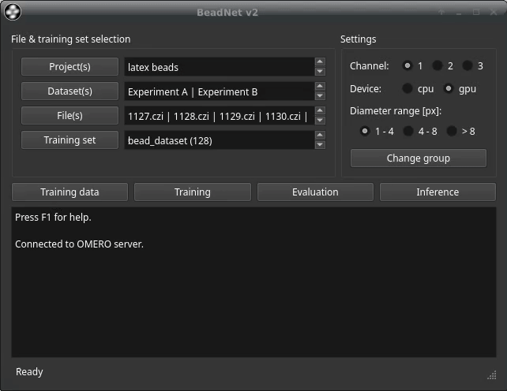

# 

BeadNet v2 is a deep learning-based tool for particle detection, e.g., fluorescent latex beads. The workflow covers training data creation, model training, model evaluation, and the application of trained models. OMERO is used for a comprehensive data management. So far, 2D and 2D+t data are supported. For 3D data, maximum intensity projects are used.


For instance segmentation tasks, check the tool [microbeSEG](https://github.com/hip-satomi/microbeSEG).

## Prerequisites

* [Anaconda Distribution](https://www.anaconda.com/distribution/#download-section).
* For GPU use: a CUDA capable GPU (highly recommended for training).
* Access to an [OMERO](https://www.openmicroscopy.org/omero/) server (e.g., available after installation of [ObiWan-Microbi](https://github.com/hip-satomi/ObiWan-Microbi)). For testing purposes a [free demo account](http://qa.openmicroscopy.org.uk/registry/demo_account/) can be requested.

## Installation

Clone the repository and set up a virtual environment:
```
git clone https://github.com/TimScherr/BeadNet-v2.git
cd BeadNet-v2
conda env create -f requirements.yml
conda activate beadnet-v2_ve
```
Change the OMERO host, the OMERO port and the OMERO.web client port in *settings.json* if necessary.

## Getting Started with BeadNet v2

### Start BeadNet v2
Run the file beadnet.py:
```
python beadnet.py
```

The graphical user interface and the login menu open.

### Login
You need your OMERO username, host address and port for connecting to your OMERO server. Filling this information in the file *settings.json* prefills the corresponding fields.


### File & Training Set Selection
On the top left, available files and training sets can be viewed and selected. By default, only projects, datasets, files, and training sets of your default OMERO group are shown (see below how to change the group). When projects are selected, only datasets and files within these projects are shown. When datasets are selected, only files within these datasets are shown. In the training set menu, available training sets can be selected and new datasets can be created (note: only training sets for which the user has write access are shown):


For adding a new training set, the training data crop size needs to be selected. Selecting the crop size depends on the particle size and density in the images. We usually prefer annotating more crops than annotating larger crops with very many particles. 

### Settings
In the settings area, the image channel to process or extract training data crops from needs to be selected. In addition, it is possible to select the device (default: GPU if available). If no GPU is available, the corresponding radio button is disabled. The particle diameter range is important for the upsampling that is applied in the training data creation and for inference.

Your OMERO account may be assigned to different groups, e.g., when you are in multiple working groups/labs/... . To change the group, you can open the group selection menu with the corresponding button:


You can only see groups you are a member of. You can only see and select projects, datasets, files, and training sets of the selected group.

### Training Data Creation and Annotation
For creating new training data crops, files and a training set need to be selected. Open the training data menu with the corresponding button:


Users can specify to which subset selected crops can be assigned (only relevant for experts, just keep the default if you do not know what that means). The crop creation is interactive and crops from different image areas (of the same frame) are proposed:



Crops can be selected by clicking on the corresponding image or using shortcuts (1: first image, 2: second image, 3: third image, space: select/next).

After the crop creation, OMERO.web can be opened and the crops can be annotated ().

### Training Data Import and Export
Annotated training data can be imported using the *Import* button. Thereby, it can be specified if the images will be min-max normalized or keep their normalization and to which training data subset they are added (train, val, test). The imported data will be upsampled according to the selected diameter range but it is also possible to keep the initial resolution. The training data will be cropped and uploaded to OMERO into the selected training set.

Note: images need to begin with "img", e.g., "img001.tif" and the corresponding ground truth masks with "mask", e.g., "mask001.tif". The file formats '.png', '.tiff', '.tif', '.jpeg' are supported. 2D+t images need to be saved as single frames to be able to be imported. An easy way to get the files into the required format is to open them in [Fiji](https://imagej.net/software/fiji/) (sequences with "Import" -> "Image Sequence...") and save them as "Image Sequence..." (with Name=img for images and Name=mask for particle centroid masks).   

The selected training set can be exported from OMERO using the *Export* button. Not annotated images will be skipped. The exported training data are saved into the *training_dataset* folder.

### Training
In the training menu, the batch size, how many models should be trained, the optimizer and the method can be selected:


The maximum possible batch size depends on the available RAM/VRAM. Large batch sizes can reduce the training time. Small batch sizes result in less memory demand. *Adam* is always a good choice as optimizer, but we made good experiences with the *Ranger* optimizer. Best train some models with each optimizer. After starting the training process, the training data are downloaded from OMERO, the method specific labels are created and the training begins:


When the model does not improve for a certain time or the maximum number of epochs is reached, the training finishes. The models are saved into the *models* folder. The used training set for each model is also saved there (for reproducibility and documentation since the OMERO training set may change over time, e.g., new crops are added).

### Evaluation
Trained models can be evaluated on the test set of the selected training set (metrics: precision, recall, f-score,count rate, true positive rate, split rate, miss rate, add rate):


Therefore, a ground truth radius needs to be selected. This radius defines an area in which a predicted particle center needs to be.

Models trained on the selected training set are preselected. However, models trained on other training data may work as well. Evaluation results are saved into the *evaluation* folder. When the test set changes, i.e., images have been added to or removed from the test set, the scores of former evaluated models will be removed from the test set scores csv file. This is needed since the best F-score model needs to be selected on the same test set. For reproducibility (the test set on OMERO may change over time), the test set is zipped and saved to each model result. The F-scores can also be viewed in BeadNet (see next section).

### Inference
In the inference menu, the model for inference can be selected:

 

Available evaluation F-scores are shown if available. The best model is pre-selected. Results can either be saved locally or can be uploaded to OMERO. The overwrite checkbox needs to be checked to overwrite results. The used inference model and the inference date are attached as key value pairs to the processed files on OMERO.

Note: *overwrite* will remove all Point ROIs attached to a file on OMERO (also for other channels!). The OMERO.web client can to be used to view the results (Point ROIs).

I addition, the centroid positions (for initial resolution and upsampled image) for each particle and the particle counts for each frame are are attached as csv files to the corresponding image on OMERO. The images, upsampled images, particle centroid masks, upsampled image-particle centroid overlays and the csv files can be downloaded with the *export* button. The analysis results can easily be opened and plotted in Fiji.

### Stop Calculations
Training, evaluation, inference, data imports and data exports can be stopped by pressing *Control+C* in the corresponding menus. The stopping may need some time.

### Help
Press F1 to open a short help.

## OMERO
- OMERO clients overview: [https://docs.openmicroscopy.org/omero/5.6.1/users/clients-overview.html](https://docs.openmicroscopy.org/omero/5.6.1/users/clients-overview.html)
- Importing data with OMERO.insight: [https://downloads.openmicroscopy.org/help/pdfs/importing-data-5.pdf](https://downloads.openmicroscopy.org/help/pdfs/importing-data-5.pdf)
- We recommend using the OMERO.web client for viewing the data and results (the OMERO.insight clients does not show ROI planes correctly)

## Acknowledgments
* [https://bitbucket.org/t_scherr/beadnet/src/master/](https://bitbucket.org/t_scherr/beadnet/src/master/) (initial BeadNet version)
* [https://github.com/hip-satomi/microbeSEG](https://github.com/hip-satomi/microbeSEG) (code basis)
* [https://github.com/lessw2020/Ranger-Deep-Learning-Optimizer](https://github.com/lessw2020/Ranger-Deep-Learning-Optimizer) (Ranger optimizer)
* [https://git.scc.kit.edu/KIT-Sch-GE/2021_segmentation](https://git.scc.kit.edu/KIT-Sch-GE/2021_segmentation) (segmentation method)

## Bead Dataset
An annotated bead data set is available in the *bead_dataset* folder. Unzip and import it using BeadNet v2 to test the software. The data set is a slightly modified version of the initial bead data set (see Publication).

## Publication
When using BeadNet v2 or the Bead data, please cite:

T. Scherr et al. (2020): BeadNet: Deep Learning-Based Bead Detection and Counting in Low-Resolution Microscopy Images, Bioinformatics, doi:[10.1093/bioinformatics/btaa594](https://doi.org/10.1093/bioinformatics/btaa594).

## License
This project is licensed under the MIT License - see the [LICENSE.md](LICENSE.md) file for details.
